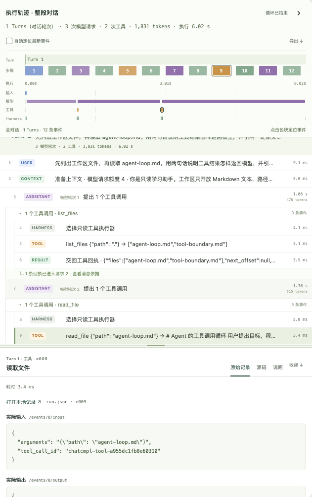

# Loop


**运行 Agent，看清每一步。**

A local workbench for running an agent and inspecting every model request, tool call, and receipt.

Loop 是本机学习工作台。你提交任务，它调用模型、列出文件、读取 Markdown，并把工具回执送回模型。网页里可以看到每一次请求、工具结果、耗时、停止原因，以及对应源码。

普通对话可读取指定目录中的 Markdown。本机还提供一个 [Go 修复练习](docs/coding-exercise.md)：授权后，Agent 在独立副本中改代码、运行容器内测试；你可以在轨迹中核对真实 diff、测试输出和退出码。



## 最短启动

需要 Git 和 [Go 1.24+](https://go.dev/doc/install)。模型接口须兼容 OpenAI Chat Completions，并支持工具调用。

```sh
git clone https://github.com/unix2dos/loop.git
cd loop
export OPENAI_API_KEY='your-api-key'
export OPENAI_MODEL='your-model-id'
export OPENAI_BASE_URL='https://your-provider.example/v1'
go run .
```

浏览器打开 [http://127.0.0.1:8877/](http://127.0.0.1:8877/)。换成自己的目录时加上 `--workspace '/absolute/path/to/notes'`。

| 变量 | 填什么 |
|---|---|
| `OPENAI_API_KEY` | 模型服务商的 API Key，不是网页登录密码 |
| `OPENAI_MODEL` | 该接口的模型 ID |
| `OPENAI_BASE_URL` | API 基础地址，不要带 `/chat/completions`。未设置时默认 `https://api.openai.com/v1` |

变量名只表示接口格式，不限制厂商。当前只实现 Chat Completions，不能直接使用 Responses 或 Anthropic Messages 地址。

<details>
<summary>示例：OpenCode Go + GLM-5.3-Flash</summary>

```sh
export OPENAI_API_KEY='your-opencode-go-api-key'
export OPENAI_MODEL='glm-5.3-flash'
export OPENAI_BASE_URL='https://opencode.ai/zen/go/v1'
go run .
```

模型 ID 和地址见 [OpenCode Go](https://opencode.ai/docs/go/#endpoints)。该组合已在本项目中完成真实工具调用验证。Loop 自己跑 Agent 循环；OpenCode Go 只提供模型 API。客户端会发送 User-Agent 和稳定会话 ID，符合其[接入要求](https://opencode.ai/docs/go/#where-can-i-use-it)。

</details>

## 看一次代码修复

启动 Docker 并按 [练习说明](docs/coding-exercise.md) 准备 Go 镜像，然后在网页选择“新任务 → 修复一个 Go 程序”。第一次先观察测试失败怎样交回模型，以及修改后的测试证据。普通对话不需要 Docker。

[MIT](LICENSE)
